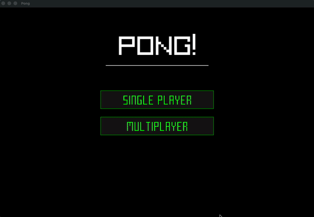

# Pong

A modern implementation of the classic **Pong** game written in **C++**.

This project focuses on clean architecture, correctness, and gameplay feel rather than raw feature count. It demonstrates structured game-state management, collision handling, and a smooth, human-like CPU opponent implemented using control-based logic.

## Demo

<p align="center">
  
</p>


## Overview

This Pong implementation was built as a learning and portfolio project with an emphasis on:

* Clear separation of game states
* Predictable and stable gameplay behavior
* Readable, well-documented code
* Avoiding unnecessary over-engineering

The codebase intentionally remains small and understandable while still addressing common pitfalls such as collision jitter, unstable AI movement, and unclear game flow.


## Features

* Single-player mode with CPU-controlled paddle
* Local multiplayer mode
* State-driven game flow

  * Main menu
  * Round start
  * Playing
  * Pause
* Angle-based ball reflection depending on paddle hit position
* Smooth, non-jittery CPU paddle movement
* Minimal UI for menus and game states


## Controls

### Single Player

* W / S or Up / Down Arrow Keys — Move paddle
* Enter — Start or resume the game
* P — Pause

### Multiplayer

* Left paddle: W / S
* Right paddle: Up / Down Arrow Keys
* Enter — Start or resume the game
* P — Pause


## CPU AI Design

The CPU paddle uses a proportional control approach rather than fixed-speed movement:

* Paddle movement speed is proportional to the distance from the target
* A dead zone prevents constant micro-adjustments and jitter
* The CPU only reacts when the ball is moving toward it
* A persistent aim offset introduces realistic, human-like mistakes

This design results in an opponent that feels smooth, fair, and beatable without relying on cheating or perfect prediction.


## Build and Run

### Requirements

* C++17 or newer
* CMake 3.15 or newer

### Build

```bash
mkdir build
cd build
cmake ..
cmake --build .
```

### Run

```bash
./Pong
```


## Possible Future Improvements

* Sound for ball deflection
* Difficulty levels by tuning AI parameters
* Sound effects and visual polish
* Codebase split into multiple source files
* Cross-platform build configuration


## License

This project is released under the MIT License.
